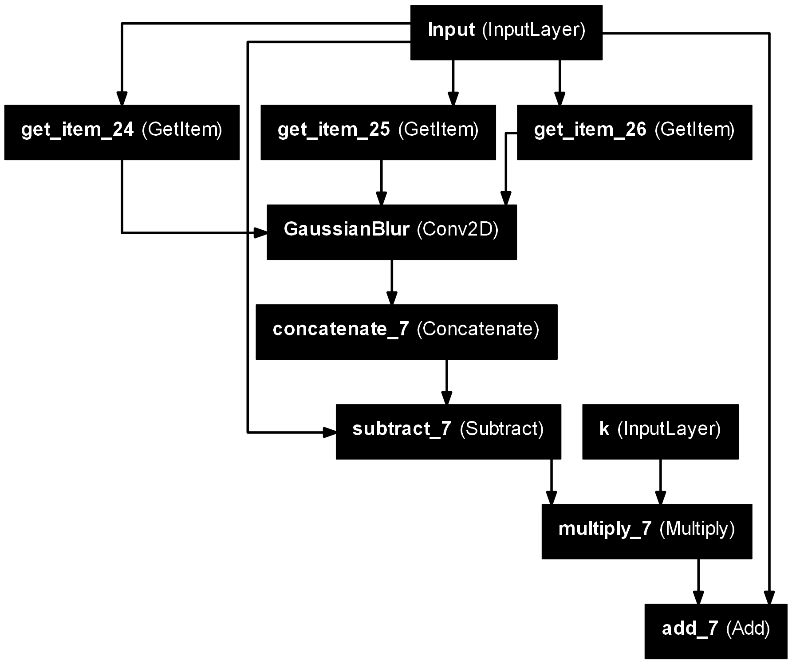
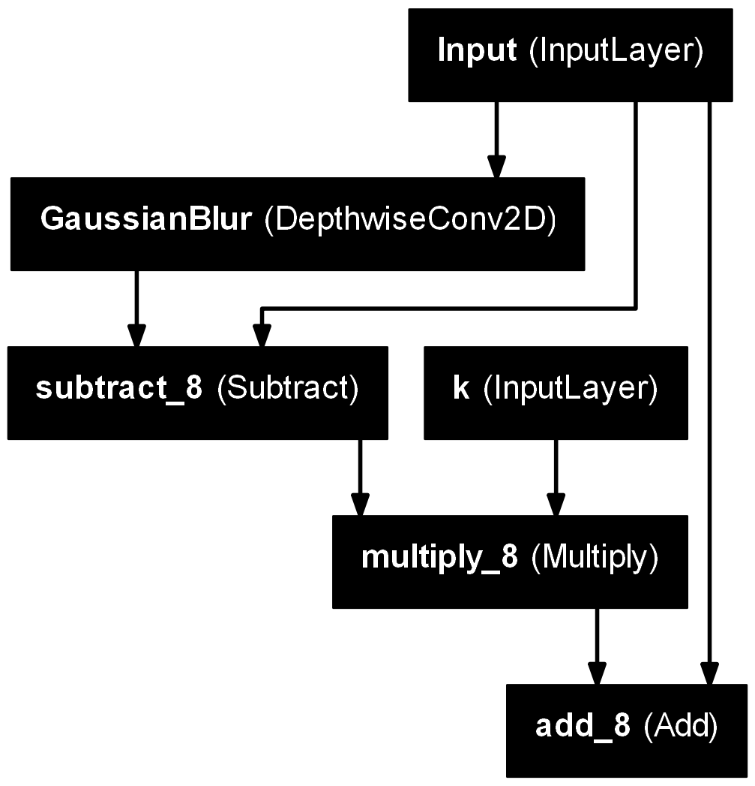
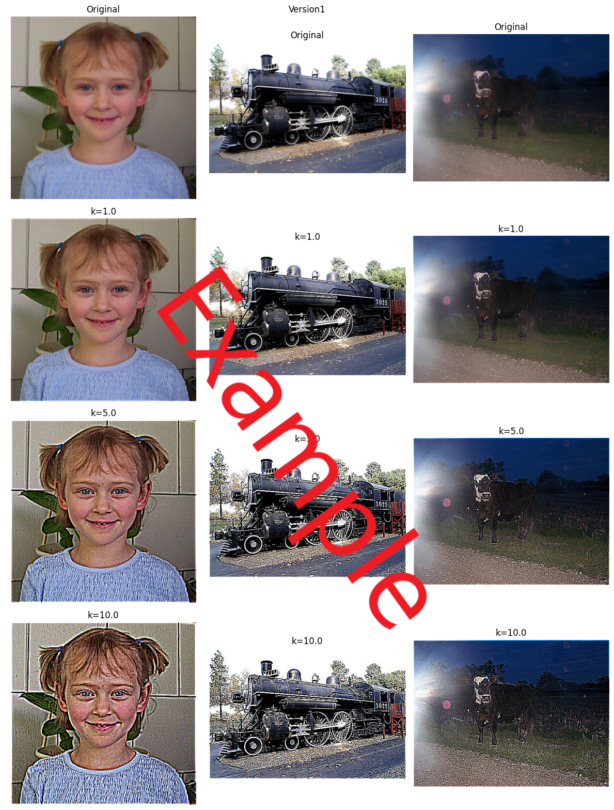
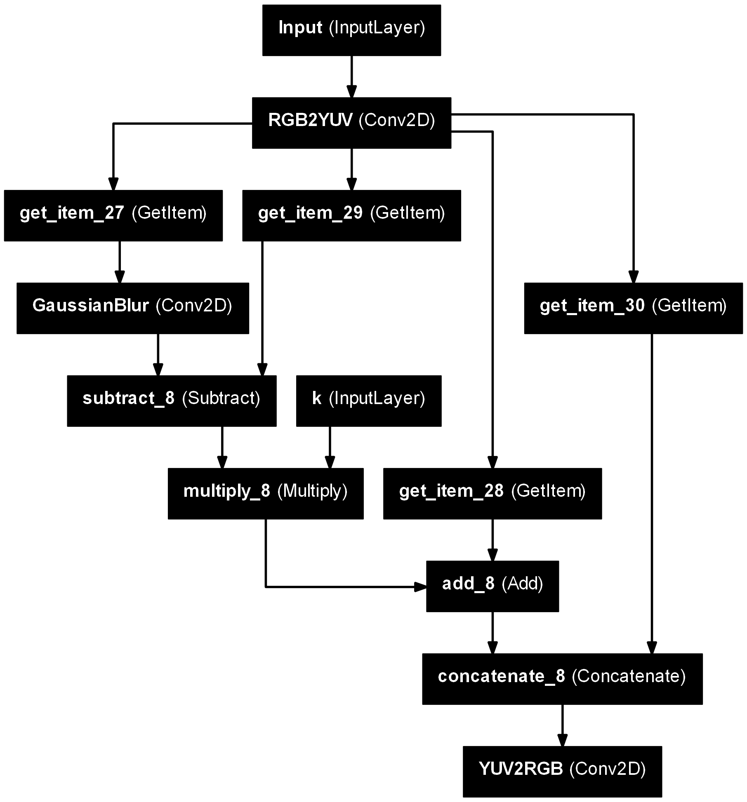
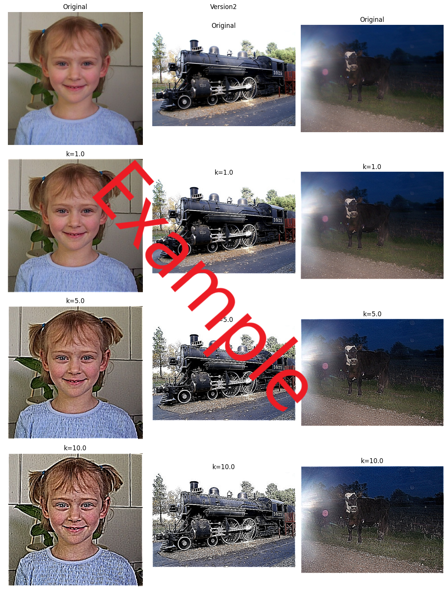

# Homework 2

Implement sharp/unsharp masking by using **Keras, TensorFlow or PyTorch** and apply it to enhance the three test images. This assignment intentionally requires the application of those libraries. The main purpose is to get started with the design of convolutional neural network architectures through this assignment.

## Basic Requirements

- You have to implement two versions of that operation.

  **Version 1:** Separately apply this operation to each of the three input channels (i.e. the R, G, and B channels).

  **Version 2:** Convert the input image to the YUV color space, then apply this operation to the Y channel, and finally convert the enhanced image back to the RGB color space.

- Submit a report to explain your codes and experimental results.

## Examples

Version 1: this example uses the depthwise convolution operation.

```py
import os
os.environ["KERAS_BACKEND"] = "tensorflow"
import keras
import numpy as np
import cv2
import matplotlib.pyplot as plt

# provide an appropriate initial value for the kernel for DepthwiseConv2D
def build_model_using_depthwiseConv2D():
    ins = keras.layers.Input(shape=(None,None,3),name="Input")
    k   = keras.layers.Input(shape=(1,),name="k")
    x1  = keras.layers.DepthwiseConv2D((5,5),depthwise_initializer= ,use_bias=False,padding='same',activation='linear',name="GaussianBlur")(ins)
    outs = ins + k*(ins-x1)
    model = keras.Model(inputs=[ins,k],outputs=outs,name="Version1")
    model.trainable = False
    return model

model = build_model_using_depthwiseConv2D()
img   = cv2.imread("TestImage1.jpg")
a     = model.predict([img[np.newaxis,:,:,[2,1,0]],np.array([[0.5]])])

plt.figure(figsize=(8,3))
plt.subplot(1,2,1)
plt.imshow(img[:,:,[2,1,0]])
plt.axis(False)
plt.title('Original')
plt.subplot(1,2,2)
plt.imshow(np.clip(a,0,255).astype(np.uint8)[0,...])
plt.axis(False)
plt.title('Gaussian Blur')
plt.show()
```







Version 2:

```py
def build_model():
    ins = keras.layers.Input(shape=(None,None,3),name="Input")
    k   = keras.layers.Input(shape=(1,),name="k")
    # convert from the RGB color space to the YUV color space
    x   = keras.layers.Conv2D(3,(1,1),kernel_initializer=,padding="same",use_bias=False,name="RGB2YUV")(ins)
    x1  = keras.layers.Conv2D(1,(5,5),kernel_initializer=,use_bias=False,padding='same',name="GaussianBlur")(x[...,:1])
    x   = keras.layers.Concatenate()([x[...,:1]+(x[...,:1]-x1)*k,x[...,1:]])
    # convert from the YUV color space to the RGB color space
    outs =keras.layers.Conv2D(3,(1,1),kernel_initializer=,padding="same",use_bias=False,name="YUV2RGB")(x)
    model = keras.Model(inputs=[ins,k],outputs=outs,name="Version2")
    model.trainable = False
    return model
```





## Demo

Watch on [Youtube](https://youtu.be).
