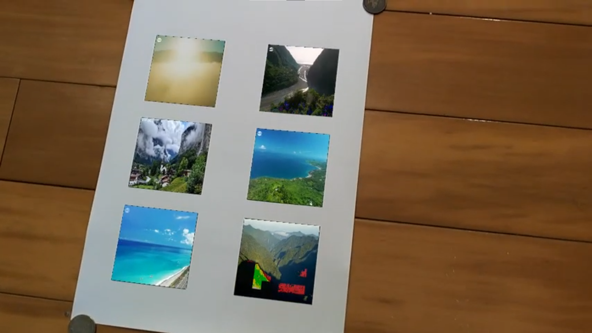

# Homework 3

#### 1. Calibrate the camera by the ChArUco board in the video file `CharUco_board.mp4`.

Show the camera matrix and distortion coefficients.

Refer to the 12nd and 13rd cells in the ipynb file `ArUco 與 ChArUco Marker 偵測、相機校正與姿態估計 opencv-contrib-python==4.6.0.66.ipynb`

#### 2. Detect the six ArUco markers in the video file `arUco_marker.mp4`.

Show six different videos on those markers for augmented reality.

#### 3. (bonus) You can create your own ArUco markers for this homework.

## Examples

