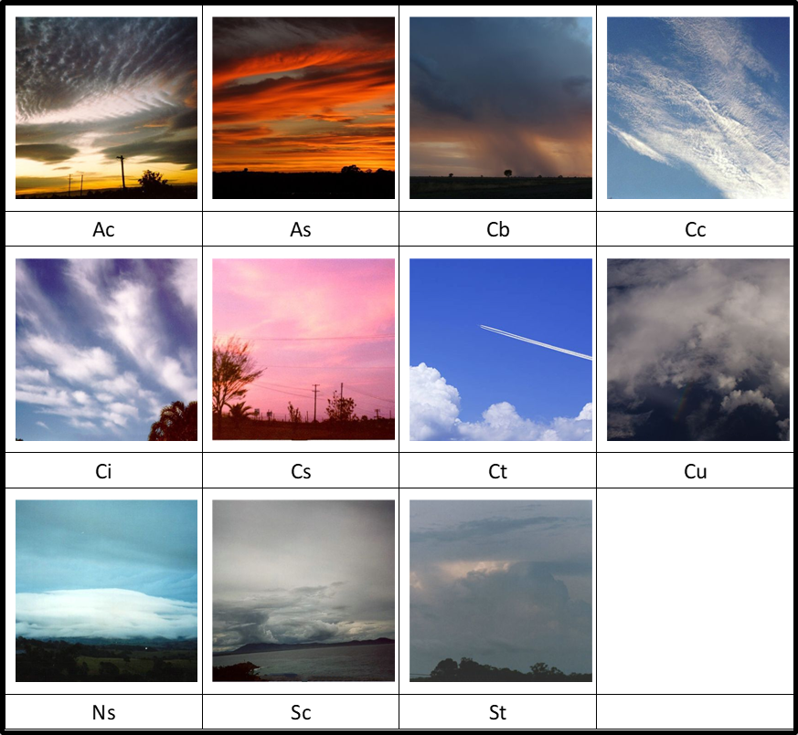

# Homework 4

The CCSN dataset contains 2543 cloud images of 11 different categories: Ac, Sc, Ns, Cu, Ci, Cc, Cb, As, Ct, Cs, St.

| 1                  | 2                 | 3                 | 4                 |
| ------------------ | ----------------- | ----------------- | ----------------- |
| Ci = cirrus        | Cs = cirrostratus | Cc = cirrocumulus | Ac = altocumulus  |
| As = altostratus   | Cu = cumulus      | Cb = cumulonimbus | Ns = nimbostratus |
| Sc = stratocumulus | St = stratus      | Ct = contrail     |

The CCSN data set is available at https://www.kaggle.com/datasets/mmichelli/cirrus-cumulus-stratus-nimbus-ccsn-database.

## Requirements:

In this homework,train at least 3 deep NNs for [the CCSN data set](https://www.kaggle.com/datasets/mmichelli/cirrus-cumulus-stratus-nimbus-ccsn-database).

- **Build two deep NNs on two pretrained models.**

  One pretrained model is a convolutional neural network, such as `VGG`, `efficientNet`, and `DenseNet` (`ResNetXXX` is prohibitted because the sample code is based on the ResNet model).

  The other pretrained model is a vision transformer-based neural network, such as `ViT`, `Swin`, `TNT`, and `PVY`. You can fine tune the pretrained model or keep the pretrained model fixed when training your deep NNs.

  1.  Show your neural architecture.
  2.  Show the plots of training and validation losses.
  3.  Show the test accuracy.

- **Build a deep NN whose neural architecture includes at least one block similar to one of the four blocks: `InceptionBlock`, `ResBlock`, `DenseBlock`, and `Attention`/`Self-Attention`.**

  1.  Show your neural architecture.
  2.  Show the plots of training and validation losses.
  3.  Show the test accuracy.
